# DeadlineIQ: Cognitive-Load AI Task Planner & Focus Companion

**Live Application URL**: [https://deadlineiq-6321f.web.app](https://deadlineiq-6321f.web.app)

DeadlineIQ is a proactive, AI-driven productivity companion designed to defeat procrastination and optimize cognitive focus. Traditional productivity tools rely on passive push alerts that users easily ignore. DeadlineIQ introduces a proactive, spatial, and cognitive approach: it analyzes your behavioral patterns, predicts task completion risks using local machine learning, and orchestrates your focus windows directly around existing commitments.

---

## User Interface & Features

### Core Interface
The main dashboard page features floating telemetry modules, active multi-agent status banners, and live task trackers styled in a premium VisionOS-inspired slate dark-mode.

<p align="center">
  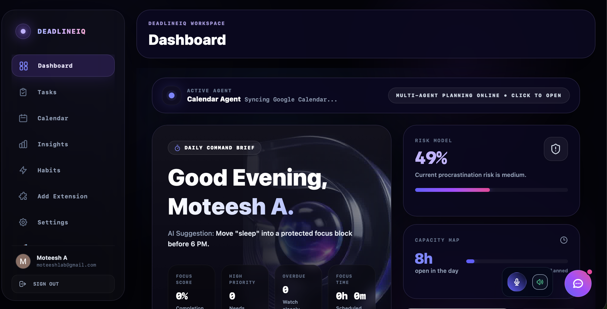<br />
  <em>Figure 1.1: Primary Spatial HUD & Telemetry Dashboard (Overview of the slate dark-mode user interface displaying active agents, focus scores, and real-time commitment pipelines).</em>
</p>

<p align="center">
  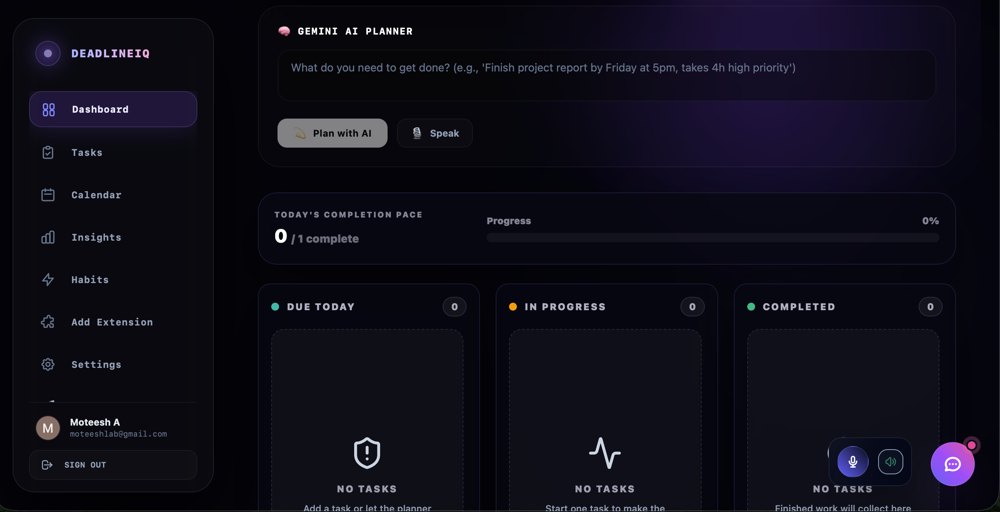
  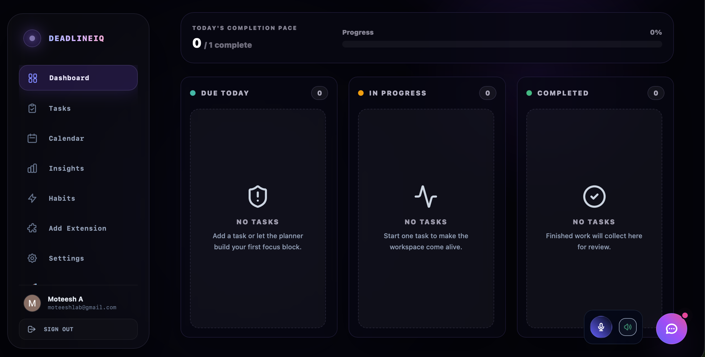<br />
  <em>Figure 1.2 (Left): Client-Side MLP Risk Assessor (A live client-side neural network predicting procrastination risk using online backpropagation learning). Figure 1.3 (Right): Capacity Map & Nudge Engine (Workload allocation tracker displaying remaining daily energy slots).</em>
</p>

### Natural Language Scheduling & AI Co-pilot
Dictate tasks using the Web Speech API. Gemini automatically parses messy text into structured tasks, subtasks, and confidence scores. Use the sliding sidebar chat to command, complete, or reschedule tasks.

<p align="center">
  
  <br />
  <em>Figure 2.1 (Left): Gemini Natural Language Parsing Interface (Task deconstruction displaying estimated cognitive load and parser confidence). Figure 2.2 (Right): Conversational "IQ Coach" Sidebar (Conversation-driven database writes and task scheduling execution).</em>
</p>

<p align="center">
  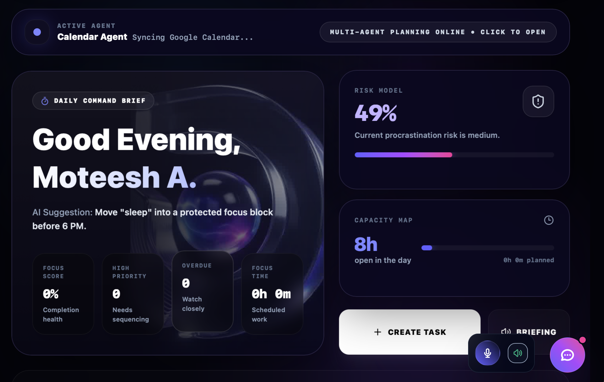
  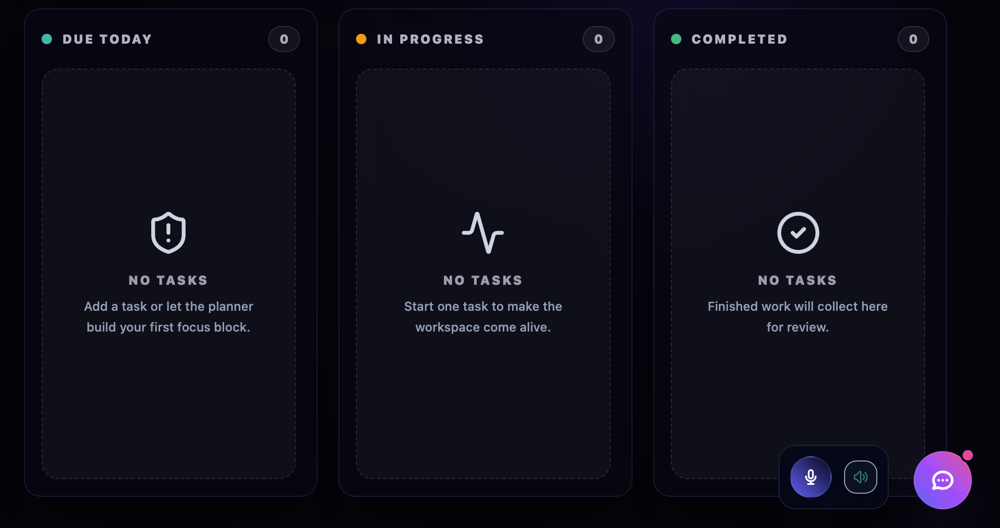<br />
  <em>Figure 2.3 (Left): Task Deconstruction Modality (Hierarchical breakdown of complex deadlines). Figure 2.4 (Right): Subtask Parameter Builder (Manual config panel for task estimates and difficulty weight adjustments).</em>
</p>

### Workload Forensics & Scheduling
Monitor routines, analyze procrastination logs to diagnose behavioral trends, and view schedules in a weekly grid integrated with Google Calendar.

<p align="center">
  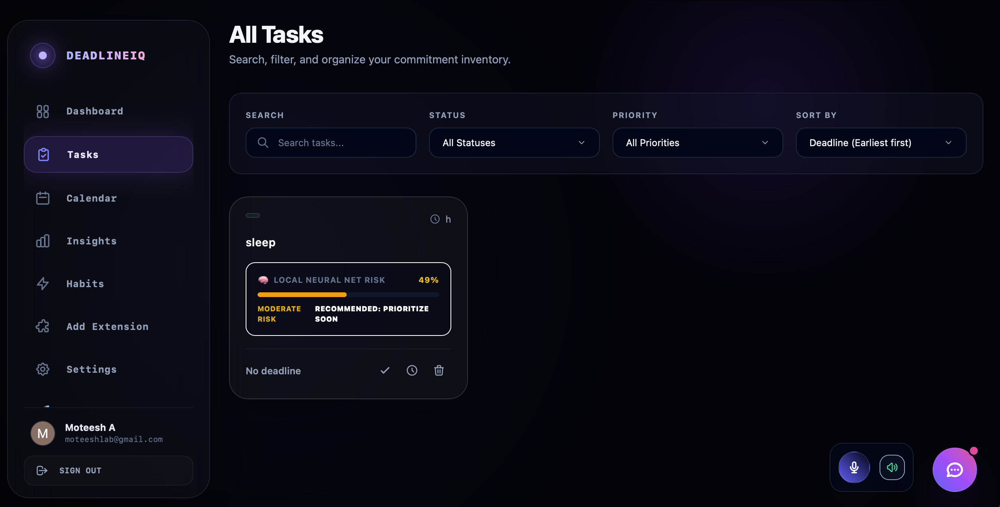
  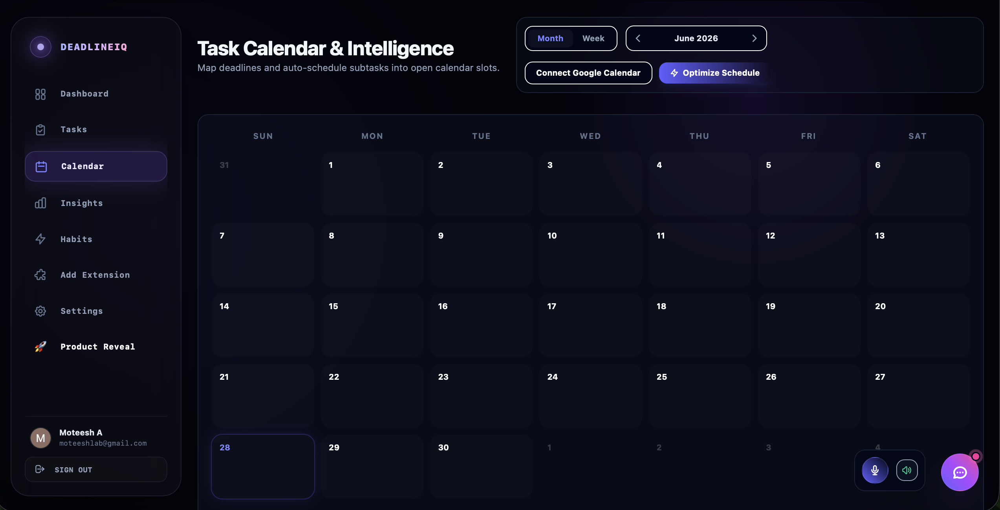
  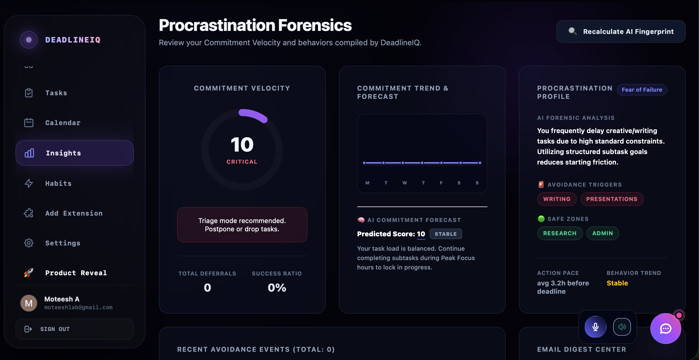<br />
  <em>Figure 3.1 (Left): Kanban Task Board (Three-column task flow pipeline). Figure 3.2 (Center): Borderless Calendar Grid (VisionOS weekly calendar synced with Google Calendar). Figure 3.3 (Right): Behavioral Forensics (Analytics dashboard mapping procrastination fingerprint profiles and score trend forecasting).</em>
</p>

<p align="center">
  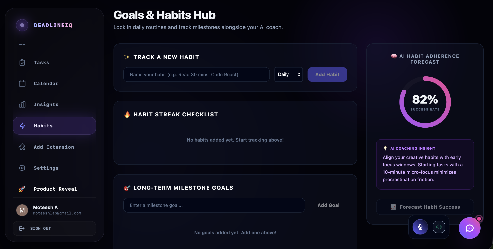
  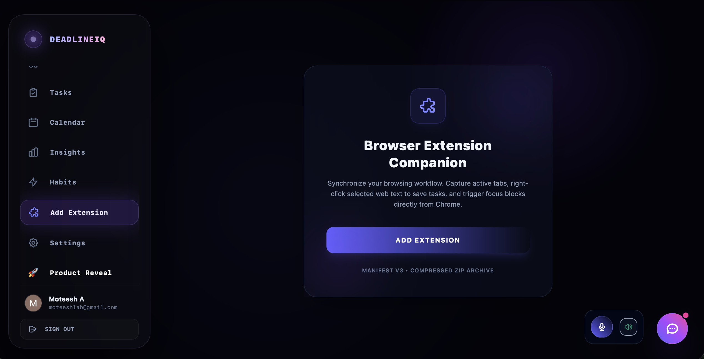
  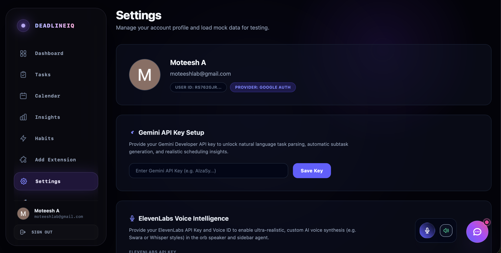<br />
  <em>Figure 4.1 (Left): Habit Streak Tracker (Circular progress routine tracking). Figure 4.2 (Center): Chrome Extension Companion (MV3 browser utility pushing web snippets directly to the cloud). Figure 4.3 (Right): Settings Panel (General controls for Gemini keys and user configuration preferences).</em>
</p>

---

## Google Technologies Stack

1. **Google Firebase Authentication**: Provides secure, seamless Google OAuth identity management and session validation.
2. **Google Cloud Firestore**: Real-time NoSQL database storing user profiles, task documents, calendar slots, and behavioral metrics under isolated document references.
3. **Google Gemini API (`gemini-2.5-flash`)**: Drives the AI task parsing engines, automatic subtask generation, and cognitive load forecasting models.
4. **Google Calendar API**: Synchronizes allocated focus slots and task deadlines directly to the user's primary Google Calendar account.
5. **Google Sheets API (Simulated Sync)**: Exports productivity logs and completed task data into Google Sheets-compatible CSV formats with simulated OAuth sync checks.
6. **Google Cloud Run**: Preconfigured containerized setups ready for serverless production scaling.
7. **Google Firebase Hosting**: Serves the optimized production assets globally under verified SSL endpoints (`*.web.app` / `*.firebaseapp.com`).

---

## Technical Architecture

- **Front-End**: React 18, Vite, Tailwind CSS (Glassmorphism, custom transitions, responsive layout).
- **Security Rules**: Production `firestore.rules` enforcing authenticated-owner-only reads/writes on all collection paths:
  ```javascript
  rules_version = '2';
  service cloud.firestore {
    match /databases/{database}/documents {
      match /users/{userId}/{document=**} {
        allow read, write: if request.auth != null && request.auth.uid == userId;
      }
    }
  }
  ```
- **Containerization**: Multi-stage `Dockerfile` serving compiled static bundles via a custom `nginx.conf` routing configuration to handle client-side HTML5 history fallbacks.
- **Client-Side MLP Neural Network**: A custom Multi-Layer Perceptron neural network built in pure JavaScript (`src/utils/localML.js`). It runs client-side online learning using supervised backpropagation over 10 epochs to adapt dynamically to user completion and deferral trends.

---

## Local Setup Guide

### 1. Prerequisites
Ensure you have **Node.js (v18 or v20)** and **npm** installed.

### 2. Clone and Install Dependencies
```bash
# Navigate to the project directory
cd deadlineiq

# Install dependencies
npm install
```

### 3. Environment Variables Configuration
Create a `.env` file in the root of the project and add your Firebase and Gemini credentials:
```env
VITE_FIREBASE_API_KEY=your_firebase_api_key
VITE_FIREBASE_AUTH_DOMAIN=your_project_id.firebaseapp.com
VITE_FIREBASE_PROJECT_ID=your_project_id
VITE_FIREBASE_STORAGE_BUCKET=your_project_id.appspot.com
VITE_FIREBASE_MESSAGING_SENDER_ID=your_messaging_sender_id
VITE_FIREBASE_APP_ID=your_firebase_app_id
```
*Note: The Gemini Developer API Key can also be entered directly in the web UI under **Settings**.*

### 4. Running the Development Server
```bash
npm run dev
```
Open [http://localhost:5174](http://localhost:5174) in your browser to view the application.

---

## Docker Deployment

To build and run the application locally using Docker:

```bash
# Build the container image
docker build -t deadlineiq .

# Run the container exposing port 80
docker run -d -p 8080:80 deadlineiq
```
Access the served app at [http://localhost:8080](http://localhost:8080).

---

## Firebase Deployment

To deploy to Firebase Hosting:
```bash
# Authenticate with your Firebase Google Account
npx firebase login

# Compile assets and deploy
npm run build
npx firebase deploy --only hosting
```
